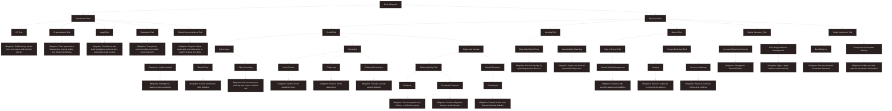

```mermaid
---
config:
  theme: neo-dark
---
graph TD
    A[Risks Mitigation] --> B[Operational Risks]
    A --> C[Financial Risks]
    B --> D[HR Risk]
    D --> D1[Mitigation: Staff training, robust hiring processes, and retention policies]
    B --> E[Organizational Risk]
    E --> E1[Mitigation: Clear governance frameworks, internal audits, and efficient workflows]
    B --> F[Legal Risk]
    F --> F1[Mitigation: Compliance with legal regulations and contracts, and regular legal reviews]
    B --> G[Reputation Risk]
    G --> G1[Mitigation: Transparent communication and quality service delivery]
    B --> H[Sharia Non-compliance Risk]
    H --> H1[Mitigation: Regular Sharia audits and strict adherence to Islamic finance principles]
    C --> I[Credit Risk]
    C --> J[Liquidity Risk]
    C --> K[Market Risk]
    C --> L[Capital Adequacy Risk]
    C --> M[Equity Investment Risk]
    I --> N[Qard Hasan]
    N --> Q[Guarantors family included]
    Q --> Q1[Mitigation: Strengthens repayment accountability]
    N --> R[Takaful Fund]
    R --> R1[Mitigation: Covers unforeseen client defaults]
    N --> S[Client Screening]
    S --> S1[Mitigation: Ensures borrower reliability and reduces default risk]
    I --> O[Murabaha]
    O --> T[Credit Checks]
    T --> T1[Mitigation: Verifies client creditworthiness]
    O --> U[Follow-ups]
    U --> U1[Mitigation: Ensures timely repayments]
    O --> V[Collateral/Guarantees]
    V --> V1[Mitigation: Provides security against defaults]
    I --> P[Salam and Istisnaa]
    P --> W[Delivery/Quality Risk]
    W --> Y[Collateral]
    Y --> Y1[Mitigation: Secures against non-delivery or defective goods]
    W --> Z[Structured Contracts]
    Z --> Z1[Mitigation: Defines obligations clearly to avoid disputes]
    P --> X[Natural Disasters]
    X --> AA[Guarantees]
    AA --> AA1[Mitigation: Protects lender from disaster-induced defaults]
    J --> BB[Diversified Cash Flows]
    BB --> BB1[Mitigation: Ensures liquidity by spreading revenue sources]
    J --> CC[Asset-Liability Matching]
    CC --> CC1[Mitigation: Aligns cash flows to prevent liquidity crises]
    K --> DD[Rate of Return Risk]
    DD --> FF[Asset-Liability Management]
    FF --> FF1[Mitigation: Matches rate-sensitive assets with liabilities]
    K --> EE[Foreign Exchange Risk]
    EE --> GG[Hedging]
    GG --> GG1[Mitigation: Reduces exposure to currency fluctuations]
    EE --> HH[Currency Matching]
    HH --> HH1[Mitigation: Balances currency inflows and outflows]
    L --> II[Increased Retained Earnings]
    II --> II1[Mitigation: Strengthens financial buffers]
    L --> JJ[Risk-Weighted Asset Management]
    JJ --> JJ1[Mitigation: Aligns capital reserves with asset risk]
    M --> KK[Due Diligence]
    KK --> KK1[Mitigation: Ensures informed investment decisions]
    M --> LL[Transparent Information Sharing]
    LL --> LL1[Mitigation: Builds trust and reduces asymmetric information]
```
